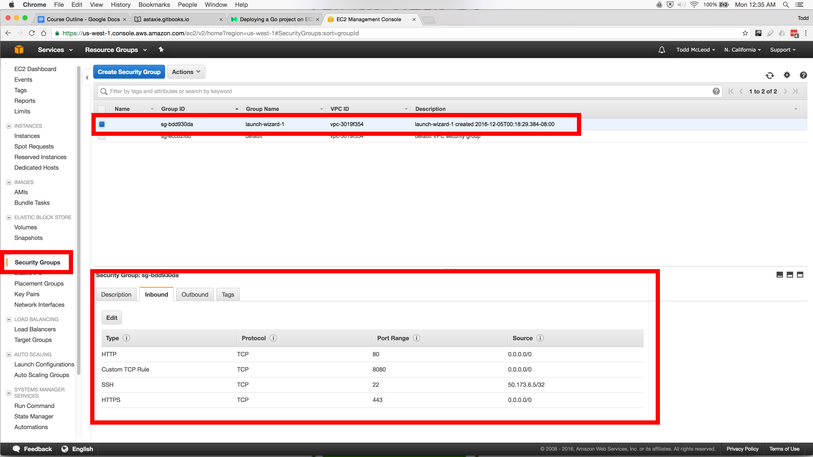

# AWS EC2

1. Create an AWS Account
  - enter credit card info

1. Sign into console

1. Create a new EC2 instance
  - services / EC2
  - launch instance
  - ubuntu
  - configure
  - create new IAM role / AmazonEC2FullAccess / ... / close window / refresh
  - add storage / 30GB free
  - add tags / webserver
  - security / ssh / http / https / custom tcp 8080
  - launch
  - create new key pair
  - launch instance

1. Create hello world
  - GOOS=linux GOARCH=amd64 go build

1. Copy you binary to the server
  - scp -i /Users/tm002/.ssh/fresnoRadon.pem ./main ubuntu@54.67.10.63:

1. Run your code
  - sudo ./main
  - check it in a browser

# Troubleshooting

A possible issue could be that you're cross-compiling for the wrong architecture: AWS might have assigned you a different machine than the one used in this example. To solve this problem, we will install Go on the AWS machine and then run "go env" to see GOOS & GOARCH for that machine.

1. download Go
  - wget https://storage.googleapis.com/golang/go1.7.4.linux-amd64.tar.gz
1. unpack go
  - tar -xzf go1.7.4.linux-amd64.tar.gz
1. remove the tar file
  - rm -rf go1.7.4.linux-amd64.tar.gz
1. make your go workspace
  - mkdir goworkspace
  - cd gowoworkspace
  - mkdir bin pkg src
  - cd ../
1. add environment variables
  - nano .bashrc
```
export GOROOT=/home/ubuntu/go
export GOPATH=/home/ubuntu/goworkspace
export PATH=$PATH:/home/ubuntu/goworkspace/bin
export PATH=$PATH:/home/ubuntu/go/bin
```
1. refresh environment variables
  - source ~/.bashrc
1. confirm installation
  - go version
1. get machine GOOS & GOARCH info
  - go env

# Troubleshooting

Sometimes students miss setting port openings in security. If you are having issues, check to make sure these settings are correct.
