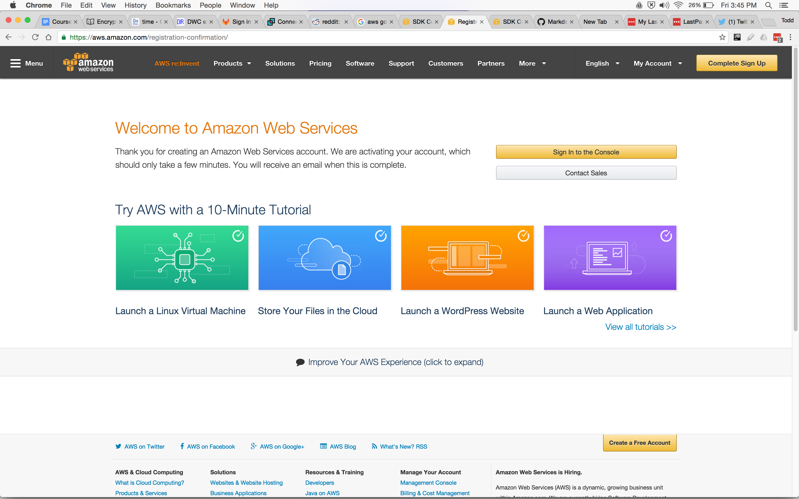
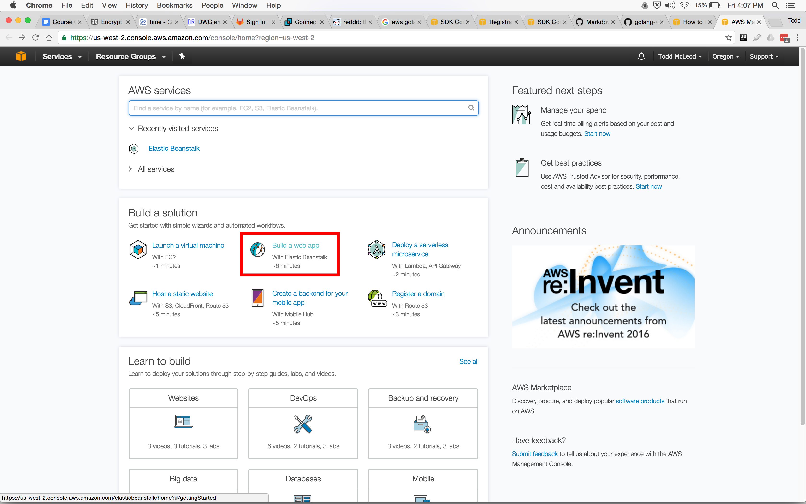

# Go & AWS

## Step #1
[AWS SDK for Go](https://aws.amazon.com/sdk-for-go/)

## Step #2 
Create an AWS Account
- Create account
  - enter credit card info
- Successful account creation:

## Step #3
make sure python is installed
python -V
python --version

## Step #4
sudo pip install awsebcli

## Step #5
Create credentials:
- access key ID
- secret access key
You create these in the "identity access management" (IAM) service in the AWS console

### (a)
Create a user for "elastic beanstalk" (EB) to use
- From the AWS consolse, navigate to "identity access management" (IAM)
- select "users"
- click "add user"
- check "Programmatic access"
  - Enables an access key ID and secret access key for the AWS API, CLI, SDK, and other development tools.

### (b)
Set permissions for demoUser
- Add user to group / create group
  - you could call it "demoGroup"
- Add permissions
  - "AWSElasticBeanstalkFullAccess"
- click "Create Group"
- click "Next: Review" (which might be offscreen, so scroll down)

### (c)
Create User
- Review that you've 
  - created a user
  - created a group
  - given the group permissions
  - added the user to the group
Click "Create User"

### (d)
Get your credentials
- access key ID
- secret access key

## Step #6
Enter your credentials for a project
- in terminal, navigate to your projects directory
- enter: eb init
  - choose region
  - enter credentials: 
    - eb-access-id
    - eb-secret-key
  - enter application name or accept default
  - select a platform - you will want to select Go
  - select a platform version - for example, maybe, Go 1.5
  - SSH - not necessary, but good idea, so choose "yes"
    - key-pair name: default "aws-eb" is fine
    - passphrase
- just FYI, in terminal enter: ls -la
  - you should see this file now: .elasticbeanstalk
    
## Step #7
Create a new application in Elastic Beanstalk
- Go to services / elsatic beanstalk
- click "create new application"
  - enter an "application name" like goDemo
  - create an "environment" by clicking "create one now"
    - choose "web server environment"
    - click "select"
  - click cancel when it asks you for platform and other info
  
## Step #8
Deploy

     
     
     
in Elastic Beanstalk Command Line Interface (EBCLI)
- go to terminal
- enter: eb
- 

## Step #3
[Create an Application with AWS Elastic Beanstalk](https://aws.amazon.com/getting-started/tutorials/launch-an-app/)

# Understanding AWS

Amazon Web Services (AWS)offers a suite of cloud-computing services that make up an on-demand computing platform. These services operate from 14 geographical regions across the world. They include Amazon Elastic Compute Cloud ("EC2") and Amazon Simple Storage Service ("S3"). 

As of 2016 AWS has more than 70 services including compute, storage, networking, database, analytics, application services, deployment, management, mobile, developer tools and tools for the Internet of things. 

Amazon markets AWS as a service to provide large computing capacity quicker and cheaper than building your own physical server farm.

## Services

### EC2 - Elastic Computer Cloud
Amazon Elastic Compute Cloud (EC2) forms a central part of Amazon.com's cloud-computing platform, Amazon Web Services (AWS), by allowing users to **rent virtual computers** on which to run their own computer applications. EC2 encourages scalable deployment of applications by providing a web service through which a user can boot an Amazon Machine Image (AMI) to configure a virtual machine, which Amazon calls an "instance", containing any software desired. A user can create, launch, and terminate server-instances as needed, paying by the hour for active servers – hence the term "elastic". EC2 provides users with control over the geographical location of instances that allows for latency optimization and high levels of redundancy.

### S3 - Simple Storage Service
Amazon S3 provides storage through web services interfaces (REST, SOAP, and BitTorrent). Amazon launched S3 in the United States in March 2006 and in Europe in November 2007.

At its inception, Amazon charged end users US$0.15 per gigabyte/month, with additional charges for bandwidth used sending and receiving data, and a per-request (get or put) charge. On November 1, 2008, pricing moved to tiers where end users storing more than 50 terabytes receive discounted pricing. Amazon says that S3 uses the same scalable storage infrastructure that Amazon.com uses to run its own global e-commerce network.

S3 uses include web hosting, image hosting, and storage for backup systems. 

### Elastic Beanstalk
AWS Elastic Beanstalk is an orchestration service offered from Amazon Web Services for deploying infrastructure which orchestrates various AWS services, including 
- EC2
- S3
- Simple Notification Service (SNS)
- CloudWatch
- autoscaling
- Elastic Load Balancers.

Elastic Beanstalk provides an additional layer of abstraction over the bare server and OS; users instead see a pre-built combination of OS and platform, such as "64bit Amazon Linux 2014.03 v1.1.0 running Ruby 2.0 (Puma)" or "64bit Debian jessie v2.0.7 running Python 3.4 (Preconfigured - Docker)".

Deployment requires a number of components to be defined: an 'application' as a logical container for the project, a 'version' which is a deployable build of the application executable, a 'configuration template' that contains configuration information for both the Beanstalk environment and for the product. 

Finally an 'environment' combines a 'version' with a 'configuration' and deploys them.

Executables themselves are uploaded as archive files to S3 beforehand and the 'version' is just a pointer to this.

Supported software include: 
- PHP
- Java
- .NET
- Node.JS
- Python
- Ruby
- Docker
- Go

[Learn how to build, deploy and manage your own applications using AWS Elastic Beanstalk](http://docs.aws.amazon.com/elasticbeanstalk/latest/dg/Welcome.html)
[AWS Elastic Beanstalk concepts](http://docs.aws.amazon.com/elasticbeanstalk/latest/dg/concepts.html)
[Learn how to create new application versions](http://docs.aws.amazon.com/elasticbeanstalk/latest/dg/applications-versions.html)
[Learn how to manage your application environments](http://docs.aws.amazon.com/elasticbeanstalk/latest/dg/using-features.managing.html)

# [Nice Official AWS "AWS Elastic Beanstalk Deployment Walkthrough" Video](https://www.youtube.com/watch?v=xhc1boyBkJw)
