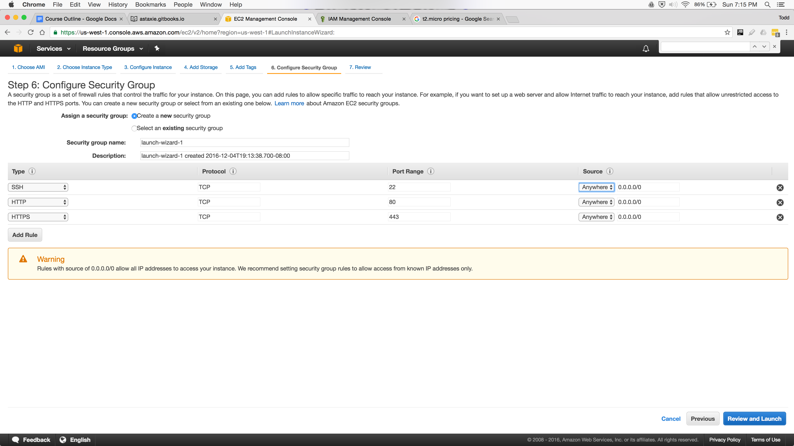

# STEP #1
Sign into AWS Management Console

# STEP #2
Choose "services" and "EC2" (elastic cloud compute)

# STEP #3
- Choose Location (top-right, next to name)
  - not all locations have all options
- Launch instance
  - select Ubuntu
  - [choose the capacity of your machine](https://www.google.com/webhp?sourceid=chrome-instant&ion=1&espv=2&ie=UTF-8#q=t2.micro+pricing)
- Configure Instance Details
  - create new IAM role / AmazonEC2FullAccess
- Next: Add Storage
  - Free tier eligible customers can get up to 30 GB of EBS General Purpose (SSD) or Magnetic storage. Learn more about free usage tier eligibility and usage restrictions.
- Next: Add Tags
- Next: Security Group

