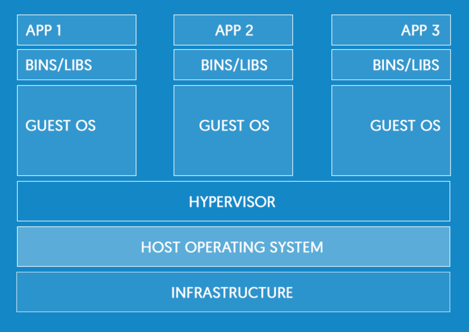
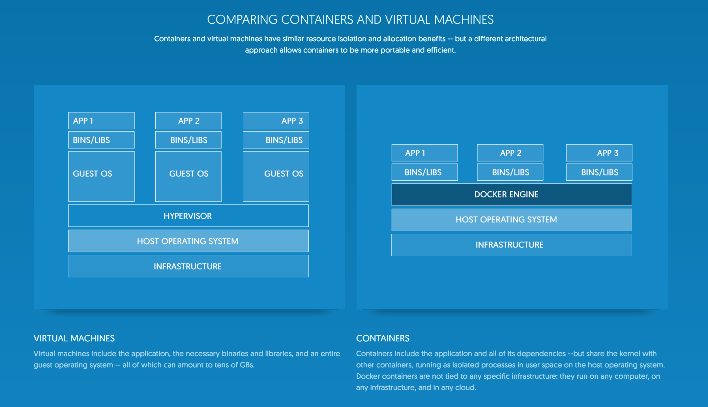
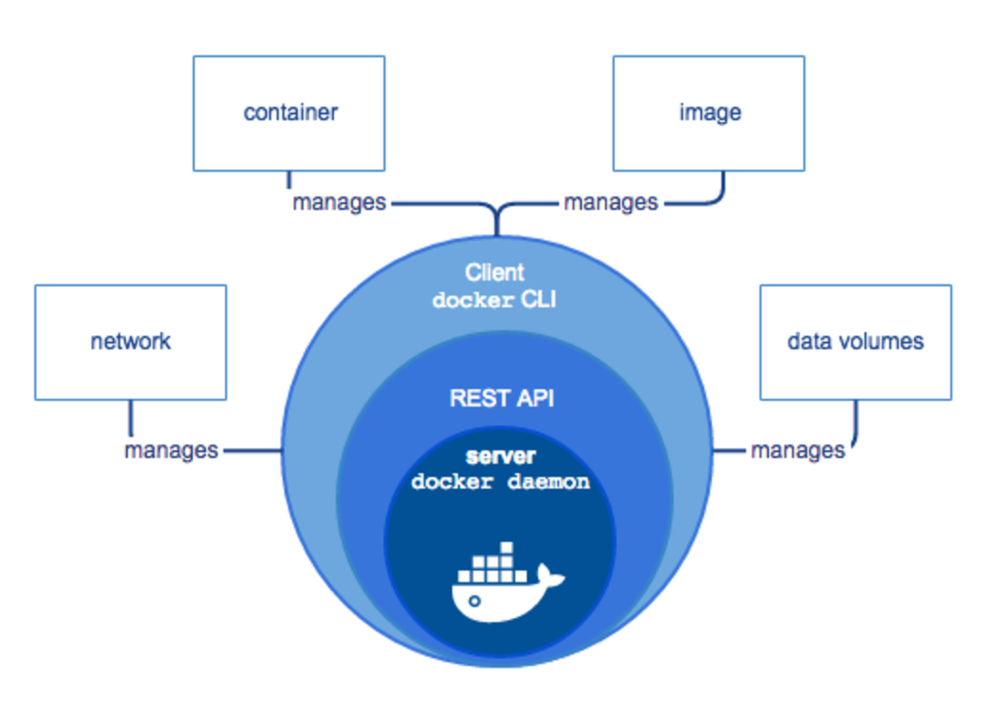

# Applications & machines

Back in the day, an application would be created and run on a machine. There was a ratio of 1:1. One application, one machine.
 
When wondering what type of a machine to purchase for their application, developers always purchased the most powerful machine possible. There was no certainty as to how much an application might be in demand. To cover their asses, they errored on the side of too much power instead of not enough.

The result of this: many machines were greatly underutilized. Many machines only ran at a small fraction of their capacity.

# Virtual machines

There were many machines with unused capacity.

Virtual machines found a way to use that capacity.

One physical machine could host several virtual machines.

Each virtual machine appeared just like a real machine to its user.

Here is an image from [docker's website](https://www.docker.com/what-docker) that shows the architecture of virtual machines:

There was a downside to this, though: each virtual machine had its own operating system. This created license and maintenance costs, as well as using up resources on the physical machine.

The question arose: **Is there a way to divide up a physical machine, but only have one operating system on that machine?**

# Containers

Linux is built in such a way that you can create separate user spaces. 

Each user space is in a separate isolated "sandbox" area. Each user space has its own file system and processes. These user spaces are all segregated and separate from each other.

Containers leverage this technology of the Linux operating system.

A container is just like a virtual machine WITHOUT THE OPERATING SYSTEM.

Each PHYSICAL MACHINE has ONE LINUX OPERATING SYSTEM.

Containers use the Linux OS of the physical machine. 

To the user, each container appears just like a real machine.

Here is an image from [docker's website](https://www.docker.com/what-docker) that shows a comparison between virtual machines and containers:

Containers and virtual machines have similar resource isolation and allocation benefits -- but a different architectural approach allows containers to be more portable and efficient.

## Virtual machines

Virtual machines include the application, the necessary binaries and libraries, and an entire guest operating system -- all of which can amount to tens of GBs.

## Containers

Containers include the application and all of its dependencies --but share the kernel with other containers, running as isolated processes in user space on the host operating system. **Docker containers are not tied to any specific infrastructure: they run on any computer, on any infrastructure, and in any cloud.**

# Docker

Docker is the most popular container system.

You build an **IMAGE** and then create as many **CONTAINERS** as you would like from that image.

You can then run those containers on physical machines.

Docker containers run on Linux, Mac OS, and Windows.

The official description: Docker is an open platform for developing, shipping, and running applications. Docker enables you to separate your applications from your infrastructure so you can deliver software quickly. With Docker, you can manage your infrastructure in the same ways you manage your applications. By taking advantage of Docker’s methodologies for shipping, testing, and deploying code quickly, you can significantly reduce the delay between writing code and running it in production.
[source](https://docs.docker.com/engine/understanding-docker/)

# Docker benefits

## Run anywhere, easily

Docker containers wrap a piece of software in a complete filesystem that contains everything needed to run: code, runtime, system tools, system libraries – anything that can be installed on a server. This guarantees that the software will always run the same, regardless of its environment.

Docker containers are based on open standards, enabling containers to run on all major Linux distributions and on Microsoft Windows -- and on top of any infrastructure.

## Secure

Containers isolate applications from one another and the underlying infrastructure

## Lightweight

Containers running on a single machine share the same operating system kernel; they start instantly and use less RAM than VMs. 

## Accelerate developers

Stop wasting hours setting up developer environments, spinning up new instances, and making copies of production code to run locally. With Docker, you simply take copies of your live environment and run them on any new endpoint running a Docker engine.

## Focus on microservices

The isolation capabilities of Docker containers free developers from constraints: they can use the best language and tools for their application services without worrying about causing internal tooling conflicts.

## Collaborate

Docker creates a common framework for developers and sysadmins to work together on distributed applications

## Docker repositories (like Docker hub)

Store, distribute, and manage Docker images in Docker Hub with your team. Image updates, changes, and history are automatically shared across your organization.

## SHIP 7X MORE

On average, Docker users ship 7X more software after deploying Docker in their environment. More frequent software updates provide added value to customers.

## Scale

Docker containers spin up and down in seconds, making it easy to scale application services to satisfy peak customer demand, and then reduce running containers when demand ebbs.

## Debugging

Docker makes it easy to identify issues, isolate the problem container, quickly roll back to make the necessary changes, and then push the updated container into production. Isolation between containers makes these changes less disruptive than in traditional software models.

## Orchestration

Automate deployment, scaling, and management of containerized applications with  **Docker Swarm** or **Kubernetes**.