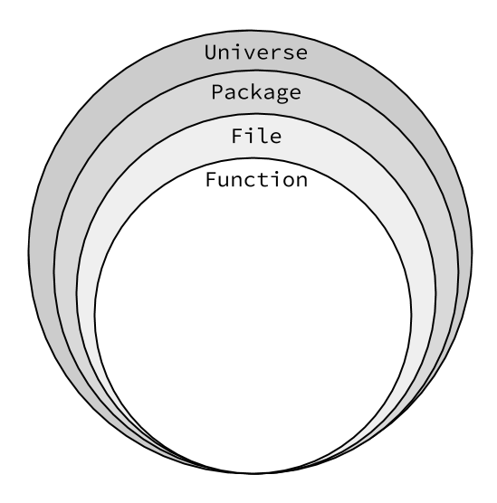

# Great reference

[Alex Edwards Code Organization Article](http://www.alexedwards.net/blog/organising-database-access)

# Code organization

How you organize your code depends upon the project and your abilities.

Do not sacrifice simplicity & readability for brevity & cleverness.

Your goal should be to write code which is maintainable. This means that an intermediate developer should be able to sit down, read your code, understand it, and work with it.

# Different Approaches

## One package

When needed we can put variables in the package scope

## Two packages 

We will import the code from the second package when needed

## Three+ packages with package for config variables

We will import the code from the config package when needed. The config package will hold variables like DB and TPL

FYI: there is no global scope in Go

