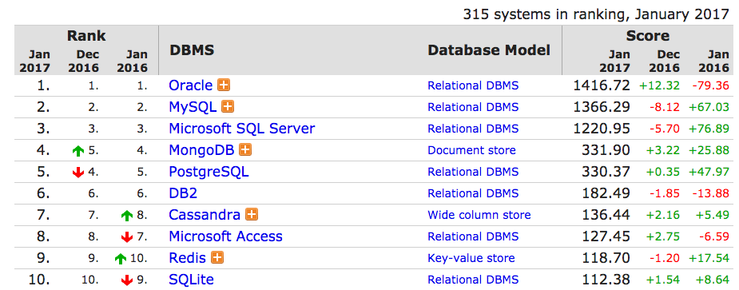

# NoSQL v SQL

## Consistency, Availbility, Partitionability (CAP)

The CAP Theorem says you can have any two of those three.

### SQL: Consistency & Availability

SQL doesn't scale well.

### NoSQL: Availability & Partitionability

Scales well, however, it is eventual consistent.

FYI: NoSQL can also be thought of a **schemaless**. You do not define any schema. There is no defining that a table is this way or that way. There is no defining that tables are connected in different ways. With SQL, the schema is imposed by the RDBMS. With schemaless nosql, the schema needs to be imposed by the developer; the developer needs to make it all work.

## Types

### Key-Value

Items are stored as key-value pairs.

KV dbs usually lack the query capabilities of other nosql dbs.

You can use KV dbs for memcache, tracking transient data, large object storage.

[source: www.3pillarglobal.com](http://www.3pillarglobal.com/insights/exploring-the-different-types-of-nosql-databases)

Examples: Redis, Riak

### Document

Like a key-value store but the value has greater structure, such as JSON or BSON (binary encoding of JSON).

**Denormalizing data is common with document dbs**: data that is frequently queried together should be stored together.

Example: a blog post would have the blog post, comments, and likes all stored together.

Document dbs have indexing and querying capability (you can look data up by more than just the key).

You can use document dbs for web apps, data with variable schema, JSON, denormalized data (structures embedded in structures).

Examples: Mongodb, couchdb

### Column

Designed for super huge scale; run on clusters.

More complicated than key-value and document dbs.

Data is stored in columns, rather than rows.

Up to this point, we have been thinking about data storage in terms of rows. RDBMS stores data in rows. Key-value and Document nosql store data in rows (for this key, here is the value). 

With column nosql, data is stored in columns. This has performance gains.

"Relational databases store all the data in a particular table’s rows together on-disk, making retrieval of a particular row fast.  Column-family databases generally serialize all the values of a particular column together on-disk, which makes retrieval of a large amount of a specific attribute fast.  This approach lends itself well to aggregate queries and analytics scenarios where you might run range queries over a specific field." [source](http://www.jamesserra.com/archive/2015/04/types-of-nosql-databases/)

Examples: Big Table (google), Cassandra (facebook), HBase

Use this if you are creating the next facebook social network, the next google search engine, big science, stock market analysis, writing vast amounts of data quickly and being able to query it.

### Graph

Great for interconnected data; relationships: who knows who.

Stores information about networks such as social relations.

# MongoDB

The [world's leading NoSQL database](http://db-engines.com/en/ranking).

## Mongo --> Database --> Collection --> Document

A nosql database has collections which have documents.
A rdbms database has tables      which have records.

### Document

A collection of key-value pairs.

The value is a dynamic schema - it can change from document to document. Documents can have different fields and structure; fields with the same name in different documents can hold different types of data.

| RDBMS | MongoDB |
|--- | --- |
| database | database |
| table | collection |
| row | document |
| field | field |
| join | embed |
| primary key | default key _id provided by mongo |

## advantages over RDBMS

1. documents can vary
1. store objects as they are in your program
1. you don't have to do join queries
1. scalability performance

## data modeling

Denormalize your data (combine data that will be used together). Sometimes you hear this referred to as "join on write, not read."

Having duplicates of stored data can be fine!

