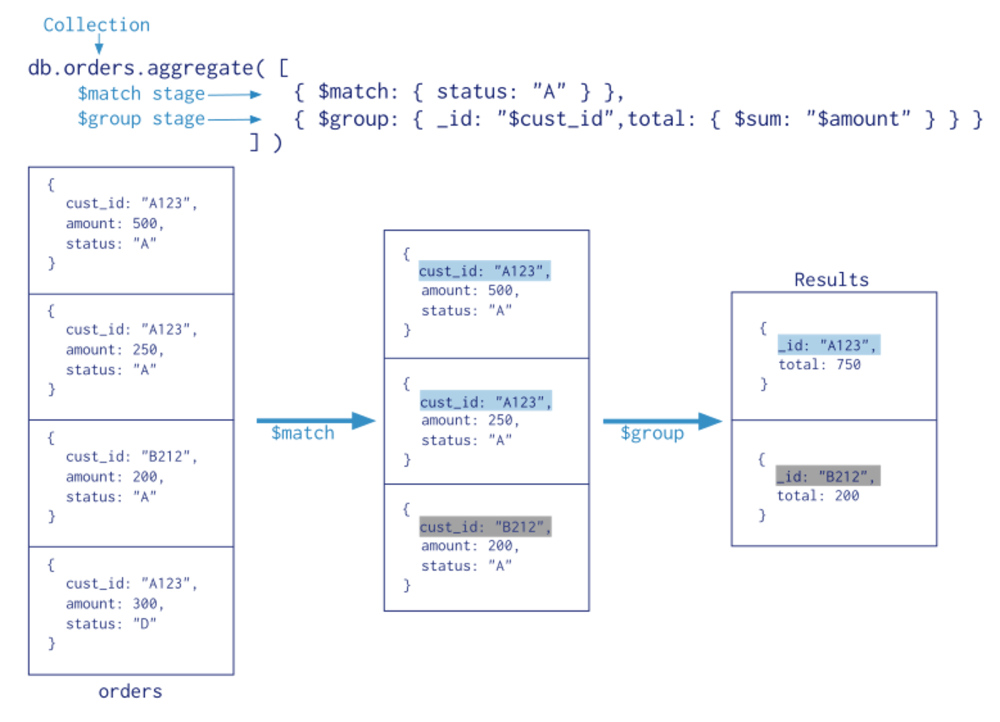

# aggregate

Aggregations operations process data records and return computed results. Aggregation operations group values from multiple documents together, and can perform a variety of operations on the grouped data to return a single result. MongoDB provides three ways to perform aggregation: the aggregation pipeline, the map-reduce function, and single purpose aggregation methods.

[documenation about aggregation](https://docs.mongodb.com/manual/aggregation/)

## single purpose aggregation

[documenation about single purpose aggregation](https://docs.mongodb.com/manual/aggregation/#single-purpose-agg-operations)

There are two functions you can use:

#### [db.collection.count()](https://docs.mongodb.com/manual/reference/method/db.collection.count/#db.collection.count)

#### [db.collection.distinct()](https://docs.mongodb.com/manual/reference/method/db.collection.distinct/#db.collection.distinct)

```
db.collection.distinct(field, query, options)
```

| Parameter | Description |
| --- | --- | 
| field | The field for which to return distinct values.
| query | A query that specifies the documents from which to retrieve the distinct values.
| options | Optional. A document that specifies the options. See Options.

#### examples - count()
```
db.oscars.count()
```

```
db.oscars.find().count()
```

```
db.customers.find({role:"citizen"}).count()
```

```
db.customers.find({$or: [{name:"Bond"}, {age:{$gt:32}}]}).count()
```

#### examples - distinct() - setup
```
db.inventory.insert([
{ "_id": 1, "dept": "A", "item": { "sku": "111", "color": "red" }, "sizes": [ "S", "M" ] },
{ "_id": 2, "dept": "A", "item": { "sku": "111", "color": "blue" }, "sizes": [ "M", "L" ] },
{ "_id": 3, "dept": "B", "item": { "sku": "222", "color": "blue" }, "sizes": "S" },
{ "_id": 4, "dept": "A", "item": { "sku": "333", "color": "black" }, "sizes": [ "S" ] }
])
```

#### examples - distinct()

```
db.inventory.distinct( "dept" )
```

```
db.inventory.distinct( "item.sku" )
```

```
db.inventory.distinct( "sizes" )
```

## aggregation pipeline



```
db.<collection name>.aggregate([{<match, sort, geoNear>},{<group>}])
```

MongoDB’s aggregation framework is modeled on the concept of data processing pipelines. Documents enter a multi-stage pipeline that transforms the documents into an aggregated result.

The most basic pipeline stages provide filters that operate like queries and document transformations that modify the form of the output document.

Other pipeline operations provide tools for grouping and sorting documents by specific field or fields as well as tools for aggregating the contents of arrays, including arrays of documents. In addition, pipeline stages can use operators for tasks such as calculating the average or concatenating a string.

The pipeline provides efficient data aggregation using native operations within MongoDB, and is the preferred method for data aggregation in MongoDB.

[source](https://docs.mongodb.com/manual/aggregation/)

#### example - setup
```
db.orders.insert([
{"cust_id":"A123","amount":500,"status":"A"},
{"cust_id":"A123","amount":250,"status":"A"},
{"cust_id":"B212","amount":200,"status":"A"},
{"cust_id":"A123","amount":300,"status":"D"}
])
```

#### example
```
db.orders.aggregate([
{$match:{status:"A"}},
{$group:{_id: "$cust_id",total: {$sum:"$amount"}}}
])
```