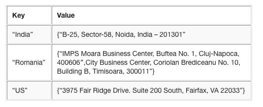

# NoSQL v SQL

## Consistency, Availbility, Partitionability (CAP)

The CAP Theorem says you can have any two of those three.

### SQL: Consistency & Availability

SQL doesn't scale well.

### NoSQL: Availability & Partitionability

Scales well, however, it is eventual consistent.

FYI: NoSQL can also be thought of a schemaless. You do not define any schema. There is no defining that a table is this way or that way. There is no defining that tables are connected in different ways. With SQL, the schema is imposed by the RDBMS. With schemaless nosql, the schema needs to be imposed by the developer; the developer needs to make it all work.

## Types

### Key-Value

### Document
### Column
### Graph

# MongoDB

The [world's leading NoSQL database](http://db-engines.com/en/ranking).

## 

